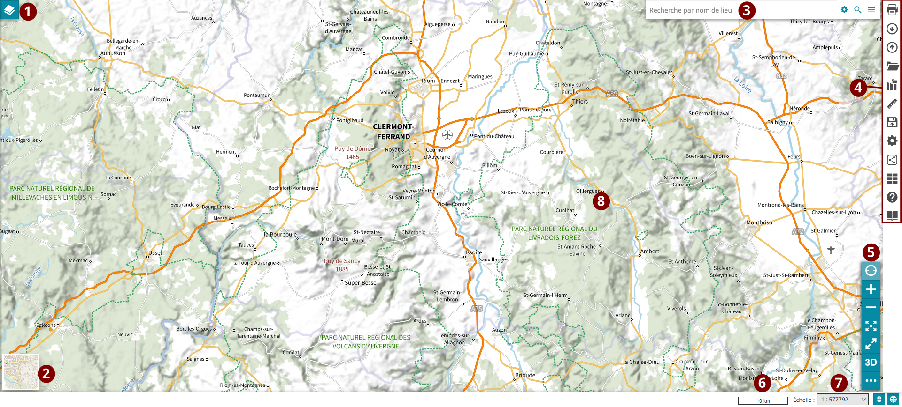
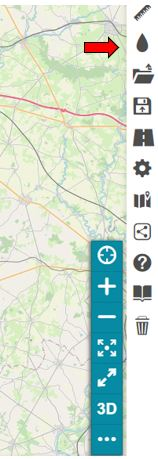

## Vue globale de MapStore2

Vous trouverez ci-dessous une vue globale standard de MapStore2.

Nous nous intéresserons aux éléments 3 et 4 pusiqu'ils vous permettront d'accéder au module de gestion des documents :

## Permettre l'accès au module

Ce module doit être rendu visible par le créateur du contexte. Par défaut, il n'est pas accessible et doit être manuellement ajouté lors de la création du contexte.

Ce module n'est pas activé par défaut.

## Ouvrir le module

Le module est accessible de 2 façons différentes selon la configuration souhaitée par l'administrateur.

### Via la barre d'outils latérale

Voici un visuel du rendu dans la barre d'outils **SidebarMenu**.

L'icône et la tooltip peuvent évoluer selon le choix de l'administrateur.

## Fenêtre du module

Pour une description de la fenêtre principale, dirigez-vous vers la section `Fenêtre principale`.

