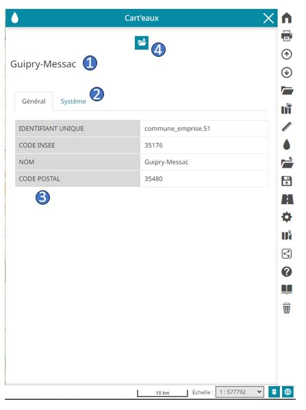
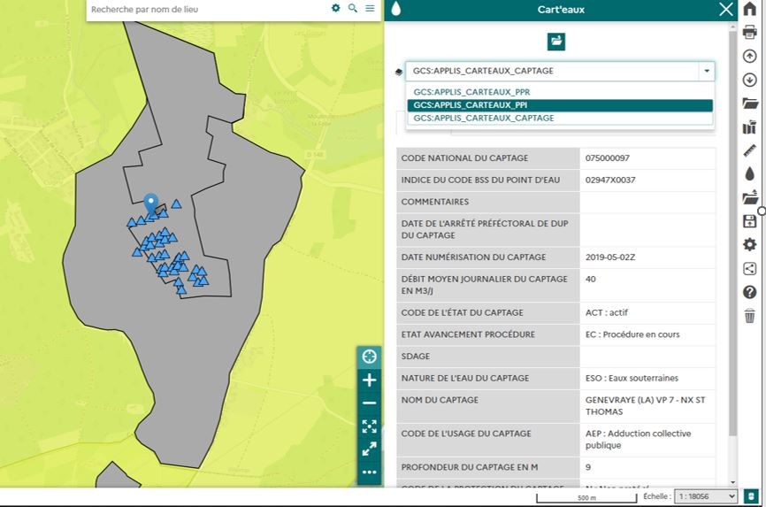

# Fenêtre principale

Le contenu de la fenêtre évolue selon la / les couches cliquées et le résultat retourné.

## Description

- **1 : Champ titre**

Cette zone affiche le nom de l'entité cliquée (selon le champ configuré par l'administrateur).

- **2 : onglets**

On trouvera ensuite les onglets comme définis par l'administrateur. Ces onglets permettent de regrouper les attributs par onglet.

- **3 : Les attributs**

les attributs sont retournés sous forme de tableau.

- **4 : Documents de la sélection**

Ce bouton permet d'ouvrir le module "docs-manager" pour voir les documents associés à l'objet sélectionné.

## Vue multi-couches

Il se peut que l'utilisateur clique sur plusieurs couche affichées par le module.
Dans ce cas de figure, une liste déroulante permet de changer les entités pour voir l'entité par couche :

**Attention : Si l'utilisateur clique sur plusieurs objet d'une même couche, seule la première entité retournée est sélectionnée. Il faudra sinon faire un "zoom +" pour cliquer sur l'entité à requêter avec précision afin de lire ses attributs.**