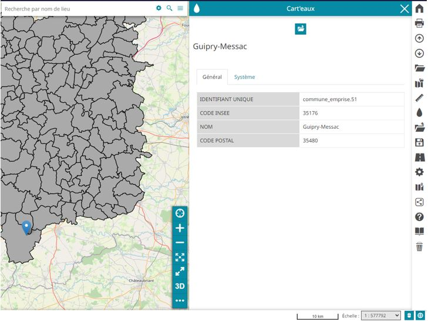

---
hide:
  - navigation
  - toc
---

# Accueil

Le module MapStore2 Data2Tab est un simple module qui permet de lire des attributs sous forme de tableau.

L'administrateur aura la possibilités de définir les couches concernées et les attributs à afficher.

