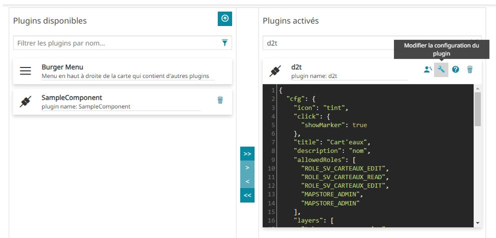

# Configuration

**Cette section permettra de comprendre comment configurer ce module MapStore.**

Avant de commencer, veuillez noter que chaque clique sur la carte réalise un appel WFS afin de récupérer les informations des couches à requêter (c.f paramètre **layers** défini plus bas).


## Ajouter ou modifier la configuration

Dans le menu d'activation des extensions, vous devez identifier dans la colonne de droite le plugin "**d2t**".

Cliquer ensuite sur le bouton "**Modifier la configuration du plugin**" pour accéder à l'interface de saisie des paramètres : 



## Example de configuration

Avant d'expliquer les paramètres, vous trouverez un exemple complet ici : 

```
{
  "cfg": {
    "icon": "tint",
    "click": {
      "showMarker": true
    },
    "title": "Cart'eaux",
    "description": "nom",
    "allowedRoles": [
      "ROLE_SV_CARTEAUX_EDIT",
      "ROLE_SV_CARTEAUX_READ",
      "ROLE_SV_CARTEAUX_EDIT",
      "MAPSTORE_ADMIN",
      "MAPSTORE_ADMIN"
    ],
    "layers": [
      "tabou:commune_emprise",
      "tabou:tabou_v_oa_operation"
    ],
    "tabs": {
      "Général": [
        [
          "test",
          "un test",
          "string"
        ],
        [
          "id",
          "identifiant unique",
          "string"
        ],
        [
          "code_insee",
          "code insee",
          "number",
          "tabou:commune_emprise"
        ],
        "nom",
        [
          "code_posta",
          "code postal"
        ]
      ],
      "Système": [
        [
          "commune_ag",
          "commune"
        ],
        [
          "x_centrbrg",
          "x"
        ],
        [
          "y_centrbrg",
          "y"
        ]
      ]
    }
  },
  "override": {}
}
```

## Paramètres

- **icon** : icône visible dans mapstore pour le bout d'activation du module
- **click** : Contient les paramètres relatifs au clique
- **click.showMarker** : Permet d'activer / désactiver l'affichage du marqueur sur les coordonnées cliquées
- **title** : Titre à afficher en en-tête de la fenêtre principale
- **description** : Champ à utiliser comme titre en haut du tableau
- **allowedRoles** : Rôles geOrchestra autorisés à lire les données (par défaut : MAPSTORE_ADMIN)
- **layers** : couches à intéroger lors du clique sur la carte
- **tabs** : liste des onglets à créer et à afficher (un onglet permet d'afficher un groupe d'attributs séparés par onglet)


## Schéma à respecter

### Schéma des onglets

En reprenant l'exemple précédent, nous trouvons deux (2) onglets : 

- Général
- Système

Pour chacun des onglets, une liste de champs est décrite selon ce schéma : 

```
"tabs": [
  "onglet_1: [
    "champ_1": [],
    "champ_2": []
  ],
  "onglet_2: [
    "champ_3": []
  ]
]
```

### Schéma des champs

Pour chacun des champs, vous devez renseigner 4 informations :

- le **nom du champ** tel que publié par la couche
- le **nom à afficher** dans le tableau et comme l'utilisateur le verra (saisie libre)
- le **type** : date | string | number
- les **couches concernées** (nom des couches séparées par une virgule "," et sans espace)

**Exemple :**

Voici par exemple le schéma à respecter pour un champ nommé **DATE_NUM** de type **date** : 

```
  [
    "DATE_NUM",
    "Date de numérisation du périmètre",
    "date",
    "WORKSPACE_A:LAYER_A,WORKSPACE_B:LAYER_B"
  ],
```

Dans cet exemple, vous pouvez voir que les noms de couche indiquent le workspace GeoServer. C'est en effet le paramètre **layer** d'une requête type **WMS**.

### Schéma complet vulgarisé
Ce schéma reprend la structure JSON complète pour un onglet :

```
"tabs": [
  "onglet_1: [
    ["NOM_CHAMP_1", "Libellé du champ 1", "string", "WORKSPACE:LAYER_A"],
    ["NOM_CHAMP_2", "Libellé du champ 2", "date", "WORKSPACE:LAYER_A,WORKSPACE:LAYER_B"],
    ["NOM_CHAMP_3", "Libellé du champ 3", "number", "WORKSPACE:LAYER_C"],
  ]
]
```

**Cet exemple vous permettra de reproduire cette structure selon vos besoins pour tous les onglets / champs.**

### Liste des couches

La liste des couches permet d'éviter de répéter un champ autant de fois qu'il y a de couche qui doivent afficher ce champs.

C'est par exemple le cas pour des champs type "ID" qui sont présents dans beaucoup de couche.

- **Exemple 1 :**

```
["NOM_CHAMP_1", "Libellé du champ 1", "string", "WORKSPACE:LAYER_A"],
```

L'utilisateur ne verra ce champ que s'il clique sur un objet de la couche **WORKSPACE:LAYER_A**.

Si le champ n'est pas dans la couche, alors le champ n'apparaîtra pas dans le tableau.

- **Exemple 2 :**

```
["NOM_CHAMP_2", "Libellé du champ 2", "date", "WORKSPACE:LAYER_A,WORKSPACE:LAYER_B"],
```

L'utilisateur ne verra ce champ que s'il clique sur un objet de la couche **WORKSPACE:LAYER_A** ou un objet de la couche **WORKSPACE:LAYER_B**.

Si le champ n'est pas dans la couche, alors le champ n'apparaîtra pas dans le tableau de résultat.