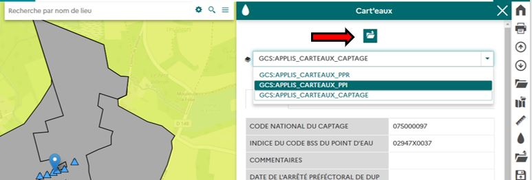

# Modules externes

**Cette section permettra de comprendre comment sont ajoutés les modules externes dans la barre d'outils**.

## Fonctionnement natif

### Déclaration des composants conteneur

Dans MapStore2, chaque module considéré et développé comme composant **conteneur** peut accueillir des modules externes.

C'est le cas des composants SidebarMenu, BurgerMenu, le header de la table d'attribut, etc...

Pour qu'un plugin soit rendu dans un composant "conteneur" ou un autre (selon les priorité ou l'affichage d'un parent conteneur ou de l'autre), il est nécessaire d'ajouter dans le code tu plugin les plugins à cibler comme ici :

- [https://github.com/jdev-org/data2Tab/blob/develop/js/extension/plugins/Module.jsx#L72](https://github.com/jdev-org/data2Tab/blob/develop/js/extension/plugins/Module.jsx#L72)

Cette modification nécessite l'intervention d'un développeur.

### Cas de Data2Tab

**Data2Tab a été développé pour être un plugin conteneur.**

Pour le module **docs-manager**, il a ainsi été défini qu'il peut être affiché dans le module **Data2Tab** s'il est chargé dans le même contexte :

- [https://github.com/jdev-org/docs-manager-front/blob/develop/js/extension/plugins/Module.jsx#L102](https://github.com/jdev-org/docs-manager-front/blob/develop/js/extension/plugins/Module.jsx#L102)

### Changer les composants conteneurs

Si vous souhaitez par exemple que docs-manager ne soit plus visible dans Data2Tab, vous devrez surcharger la configuration du plugin docs-manager via sa configuration accessible dnas le gestionnaire de module d'un contexte (ou dans le **localConfig.json** par défaut).

Vous pouvez en savoir plus via ces liens :

- [https://groups.google.com/g/mapstore-users/c/pE84A7l4zk8/m/EaOoau68AQAJ](https://groups.google.com/g/mapstore-users/c/pE84A7l4zk8/m/EaOoau68AQAJ)
- [https://docs.mapstore.geosolutionsgroup.com/en/latest/developer-guide/plugins-howto/#container-configuration](https://docs.mapstore.geosolutionsgroup.com/en/latest/developer-guide/plugins-howto/#container-configuration)

